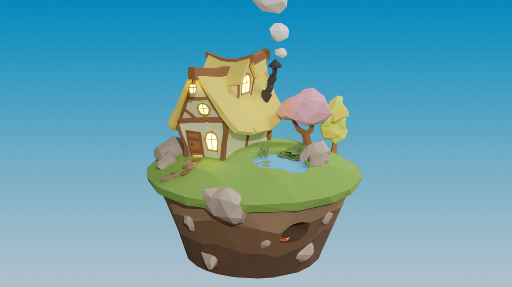
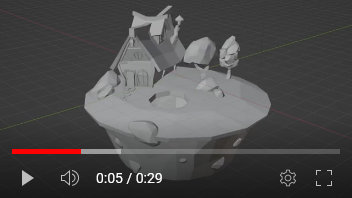

# Low-Poly Cottage in WebGL

A scene of a low-poly cottage rendered in WebGL using [Three.js](https://threejs.org/).

**http://cottage.mikemurry.com**

## Making Of

The 3d model was built in Blender, adapted from the ["Low Poly Landscapes"](https://www.gamedev.tv/courses/1462117) course on [GameDev.tv](https://www.gamedev.tv). A time-lapse of the creation of the model is available on YouTube: https://youtu.be/xQi_ulWv4iA

